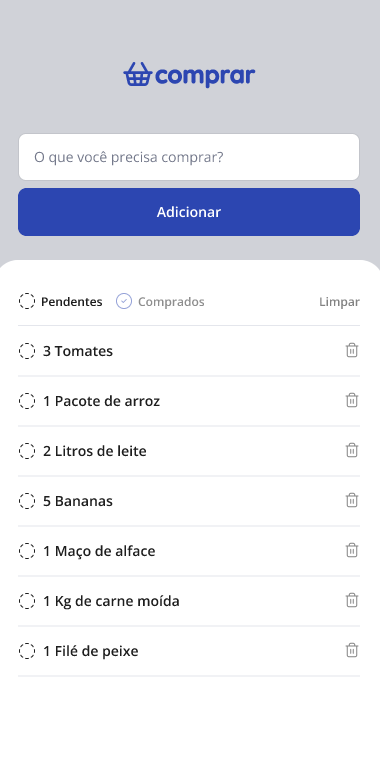

# 🛒 Lista de Compras – App Mobile  

Aplicativo mobile desenvolvido para gerenciamento simples e eficiente de listas de compras, com foco em usabilidade, organização e experiência do usuário.

---

## 🖥️ Preview do Projeto  



---

## 📌 Sobre  

Este aplicativo foi desenvolvido utilizando React Native com o objetivo de criar uma solução prática para organização de compras do dia a dia.

A interface foi projetada com foco em simplicidade, clareza visual e boa experiência em dispositivos móveis.

O usuário pode adicionar itens, marcar como comprados e removê-los da lista, com atualização visual dinâmica baseada no estado do item.

---

## 🧠 Funcionalidades  

- ✔️ Adicionar novos itens  
- ✔️ Marcar itens como comprados  
- ✔️ Separação entre Pendentes e Comprados  
- ✔️ Ícone com alteração dinâmica de cor conforme status  
- ✔️ Remoção individual de itens  
- ✔️ Interface limpa e intuitiva  
- ✔️ Componentização reutilizável  

---

## 🛠️ Tecnologias Utilizadas  

- React Native  
- TypeScript  
- Lucide Icons
- StyleSheet  
- Expo  


---

## 📥 Como Executar Localmente  

```bash
# Clonar o repositório
git clone https://github.com/WillMaac/App-Comprar.git

# Entrar na pasta do projeto
cd nome-do-projeto

# Instalar dependências
npm install

# Iniciar o projeto
npx expo start
```